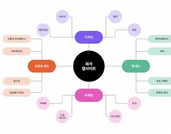

# 총괄

# 목표

회의에 대한 실시간 회의와 채팅 회의의 장단점 조율 및 시각화

## 1. 무엇을 해결할 것인가.

### 1-1. 실시간회의의 장단점과 채팅회의의 장단점

#### 실시간 회의 : 면담, 온라인 회의

장점

- 참여자끼리 즉각적으로 의견을 주고받을 수 있어 빠른 피드백과 질의응답이 가능하다.
- 정해진 시간 동안 하나의 안건에 집중하여 논의를 진행할 수 있다.
- 의견 충돌이나 이해가 필요한 부분을 바로 확인할 수 있어 비실시간 방식보다 의사결정 속도가 빠르다.

단점

- 한번의 회의에 많은 내용을 진행하여 회의가 필요하지 않는 내용과 새로운 문제가 생겨 다음 회의를 또 잡아서 총 회의에 기간이 늘어나게되는 문제
- 한번에 준비된 내용밖에 정리되지않음
- 회의 진행중 자료가 부족한 경우 다음 회의로 안건이 넘어가서 비효율이 발생
- 모든 참여자가 같은 시간에 참석해야 하기 때문에 일정을 맞추는 데 비용이 발생한다.
- 한 번 모였을 때 여러 안건을 한꺼번에 처리하려는 경향이 있어 회의 시간이 길어질 수 있다.
- 실제로 함께 모여 논의하지 않아도 되는 단순 확인, 정보 공유 등의 내용까지 회의에서 다뤄지는 경우가 있다.

#### 채팅 회의 : 카톡 대화, 투표

장점

- 정해진 회의 시간이 아니더라도 각자 가능한 시간에 의견을 제시할 수 있다.
- 모든 참여자가 동시에 시간을 맞출 필요가 없다.
- 필요한 자료를 추가로 조사한 뒤 의견을 제시할 수 있어 충분히 생각하고 답변할 수 있다.
- 기존 대화와 자료가 기록으로 남기 때문에 이전에 어떤 의견이 나왔는지 확인할 수 있다.

단점

- 실시간으로 확인하기가 어려워 의견수립에 대면회의보다 오랜기간이 걸리고 그동안 쌓인 내용을 확인하려면 일일히 굳이 나에게 필요하지 않는 내용도 읽으며 오랜시간 확인해야하는 문제가 있다
- 누군가 답변하지 않으면 다음 논의로 넘어가지 못하고 의사결정이 장기간 정체될 수 있다.
- 메시지가 시간순으로 계속 쌓이기 때문에 현재 어떤 안건을 논의하고 있는지 파악하기 어렵다.

### 1-2. 어떻게 해결할 것인가

#### 실시간 회의의 장점과 채팅 회의의 장점만을 가져와 서로의 단점을 보완한다

회의 준비 과정을 간소화하여 필요한 회의만을 진행하고자 한다

# 스토리보드

1. 워크스페이스를 파서 참여자들을 초대한다
2. 방장이 회의 안건(주제를 정한다)
3. 해당 안건이 생기거나 새로운 의견은 하위 토픽으로 나누어 진다. 
4. 토픽들은 마인드맵 형식으로 확인할 수 있도 Markdown 문서 등의 형식으로 확인 가능하다
5. 하위 토픽이 생기면 워크스페이스에 참여한 인원들은 이 하위 토픽에 참여할지 선택한다
6. 하위 토픽에 참여자들이 의견을 낸다.
7. (llm 전체 flow check)겹치거나 반대되지 않는 내용이라면 체크를 해주거나 확인을 해준다.
    
    → llm 기능
    
    - 상충되는 의견 or 중복되는 의견 check
    - 하위 토픽 추천
    - 유사도 check
8. 의견을 올리면 알람을 보낸다.
9. 그 의견에 대해 서로 의견을 나눈다. (의견에 대한 코멘트)
10. 만족할만한 결론이 나면 그 토픽에 참여한 인원들은 체크표시를 한다
11. 해당 토픽에 참여한 인원 전부가 체크표시를 하고 해당 토픽의 하위 토픽이 모두 결정 상태라면 해당 토픽은 결정된 상태가 된다
12. 결정된 토픽은 LLM이 워크스페이스를 훑은뒤 Markdown 문서 등으로 정리해준다
13. 아직 체크가 안된 토픽이 있다면 따로 LLM이 판단하여 회의를 해야할 안건 이라고 정리를 해준다

(임시)

1. ㅁㅁㅁ에 대한 회의를 진행해야하는 상황
2. 조장이 회의에서 정해야할 내용 에 추가 (기술스택, 주제)
3. 조장은 회의에 필요한 인원들을 초대
4. (마인드 맵 생성됨)
5. A는 기술스택, B는 주제에대해 조사했다고 가정
6. A가 llm에 기술스택은  c++을 사용하자고 의견제시
7. B는 주제를 ai를 사용하여 기후관련된 내용을 하자고 의견제시
8. LLM이 B가 제시한 의견에 A가 기술스택을 c++로 하고싶다고 의견을 제시했다고 알려줌
9. 체 or 대화 생성하여 B, A가 타협을 진행함
10. 아이디어에 대해 코멘트 작성
-